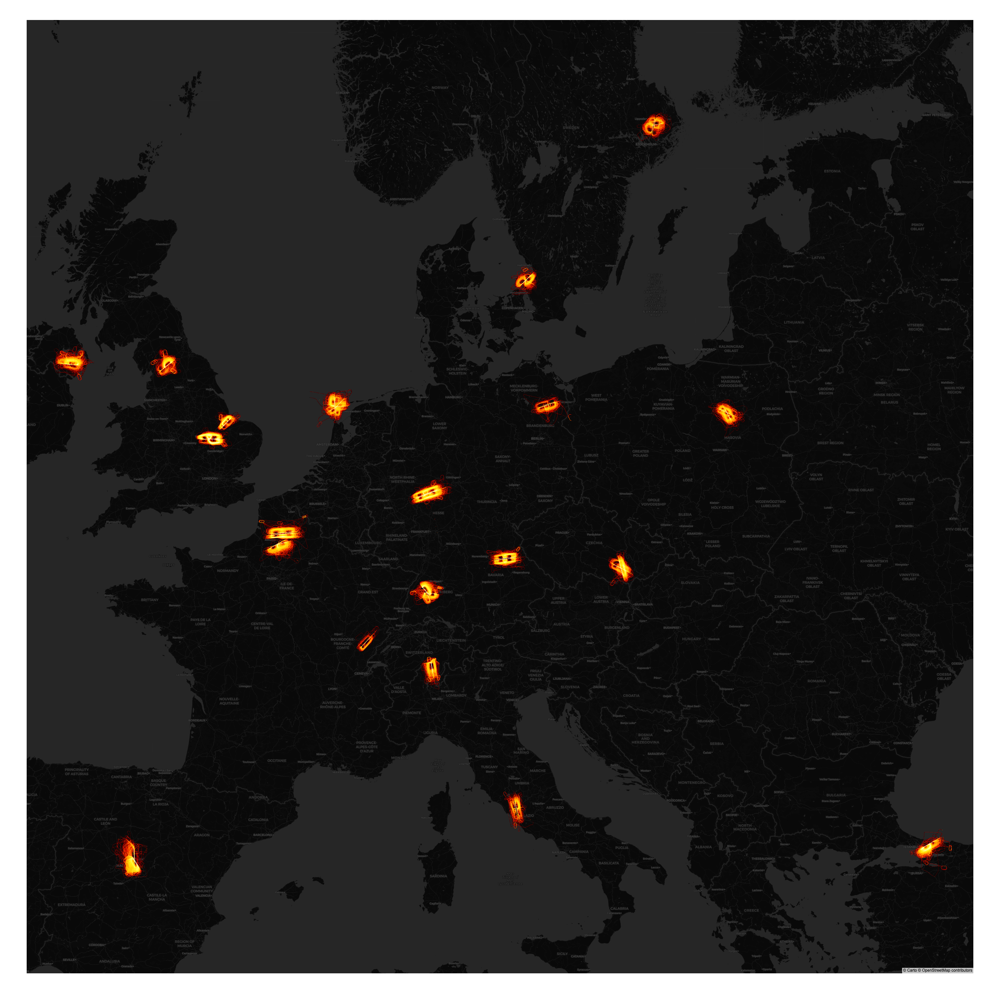

# OSN Paper Code

This repository contains the code used for the paper titled "Towards analysing the impact of Go-Around occurrences at the top European airports" that will be presented at the OpenSky Network Symposium 2023.

    

## Installation

To run this notebook, you need to have Python 3 installed on your system along with the following libraries:

- pandas
- traffic
- plotly
- scipy
- numpy

You can use `poetry` to install the dependencies by running `poetry install` in the project directory.

## Usage

To use this notebook, simply open it in Jupyter Notebook or JupyterLab and run the cells in order. The notebook assumes that the necessary data files are present in the same directory as the notebook.

**Note that trajectories used in this analysis are not part of this repository. However, it is easy for anyone with access to OpenSky to download the go-arounds using the ICAO24 and the date of the go-arounds.**

## License

This code is licensed under the MIT License. See the [LICENSE](LICENSE) file for details.
